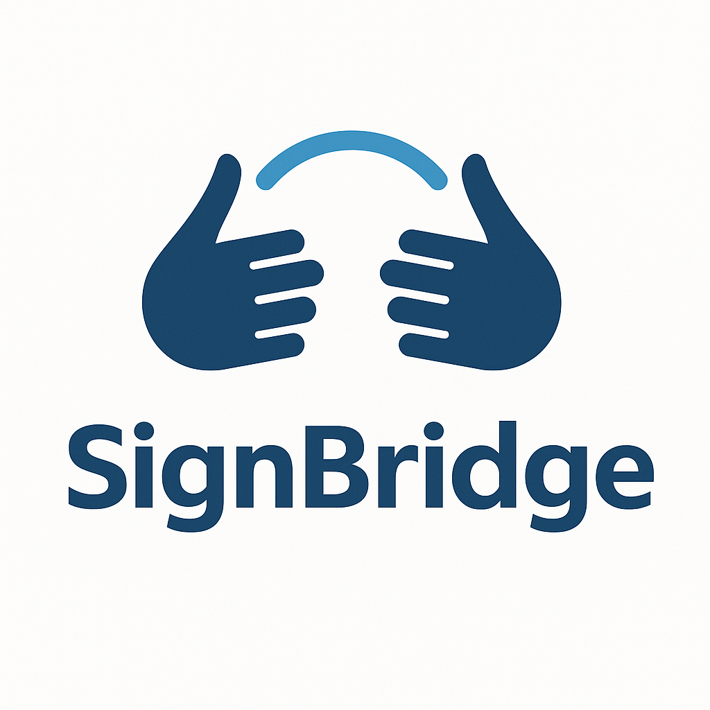
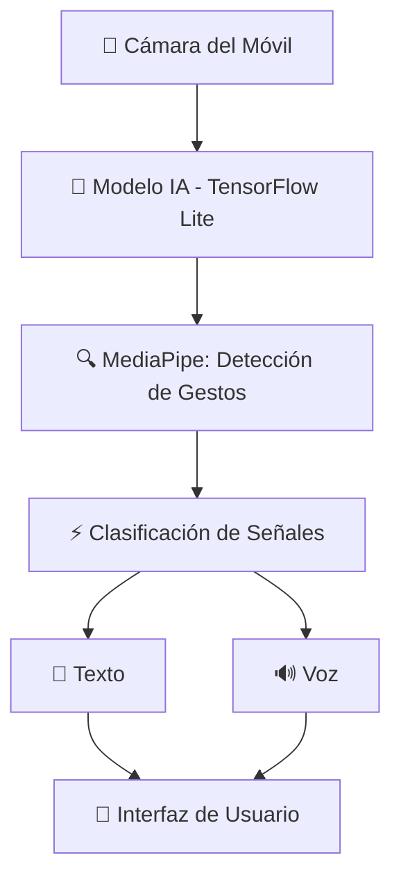

<!-- Encabezado con logo y título -->
<p align="center">
  
</p>

<h1 align="center">SignBridge 👐</h1>
<p align="center">
  <em>Creando puentes de comunicación entre personas sordas y oyentes</em>
</p>

<p align="center">
  
  
  
  
</p>

---

## 📖 Descripción

**SignBridge** es una **aplicación móvil** desarrollada para **personas sordomudas**, enfocada en **reconocer el alfabeto, números y gestos** de la Lengua de Señas mediante **visión por computadora** e **inteligencia artificial**.

El objetivo principal es **romper las barreras de comunicación** y **generar inclusión social**, creando un **puente** entre personas sordas y oyentes.

---

## ✨ Características principales

- 🖐️ **Reconocimiento de alfabeto** — Identificación de letras mediante IA.
- 🔢 **Detección de números** — Traducción automática a texto o voz.
- 👐 **Interpretación de gestos básicos** — Permite construir frases simples.
- 🎙️ **Traducción en tiempo real** — Conversión inmediata de señas a texto o audio.
- 📱 **Diseño optimizado** — Interfaz accesible, intuitiva y rápida.

---

## 🛠️ Tecnologías Utilizadas

| Tecnología            | Uso Principal                     |
|----------------------|----------------------------------|
| **React Native** / **Ionic** | Frontend multiplataforma |
| **TensorFlow Lite**  | Procesamiento IA en dispositivo  |
| **MediaPipe**        | Detección y seguimiento de gestos |
| **Node.js + Express**| API para comunicación y traducción |
| **Firebase** / MongoDB | Gestión de datos y sincronización |
| **Docker** *(opcional)* | Contenerización para despliegues |

---

## 📐 Arquitectura del Proyecto




## 🚀 Instalación y Uso
# Clonar repositorio
git clone https://github.com/usuario/signbridge.git

# Ingresar al proyecto
cd signbridge

# Instalar dependencias
npm install

# Iniciar la aplicación
npm start

## 🗺️ Roadmap

 Reconocimiento de alfabeto

 Traducción de números

 Modo offline para dispositivos de gama baja

## 📄 Licencia

Este proyecto está bajo la licencia MIT.
Consulta el archivo LICENSE
 para más información.

## 👥 Autores

Francisco Egenau — Founder & Developer

Equipo SignBridge — Machine Learning & Mobile Development:

Francisco Egenau, Sebastian Medina y Matias Machuca

<p align="center">💙 Hecho con dedicación para crear un mundo más inclusivo</p> ```
